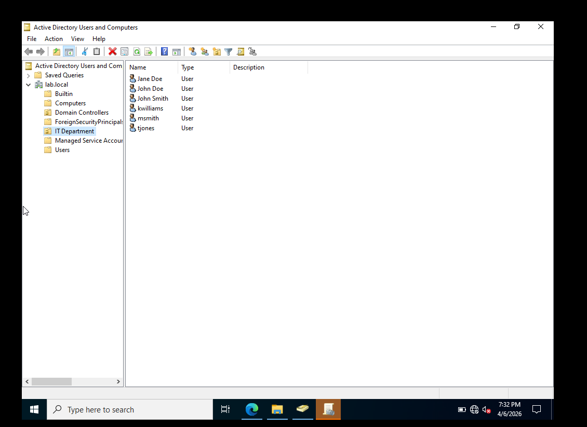
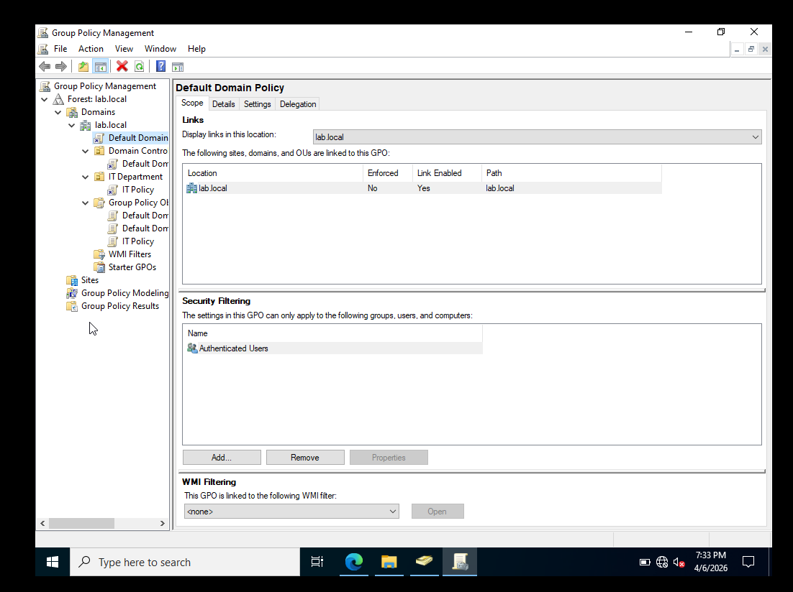

# Active Directory Lab

**Tools:** Windows Server 2022, Active Directory Domain Services, Group Policy, PowerShell, DNS, DHCP  
**Year:** 2025

## What I Built
Deployed a full Active Directory domain on Windows Server 2022 from scratch — new forest (lab.local), domain controller, OUs, and GPOs. Managed everything both through the GUI and PowerShell.

## What I Did
Handled the full user lifecycle — provisioning, password resets, and offboarding — using both GUI and PowerShell commands like New-ADUser, Set-ADAccountPassword, and Search-ADAccount. Hardened the domain via Group Policy (12-character password complexity, 5-attempt account lockout). Configured DNS A records, DHCP scopes and static reservations, mapped network drives via command line, and ran remote desktop support sessions. Monitored login activity using Windows Event Viewer — tracking Event IDs 4624 and 4625.

## What I Learned
This lab gave me a real feel for what help desk and sysadmin work actually looks like day to day. Most support tickets in an enterprise environment touch AD in some way — understanding the backend makes troubleshooting significantly faster.

## Screenshots

*IT Department OU with user accounts managed under lab.local domain*

*Group Policy Management console showing Default Domain Policy and custom IT Policy linked to IT Department OU*
