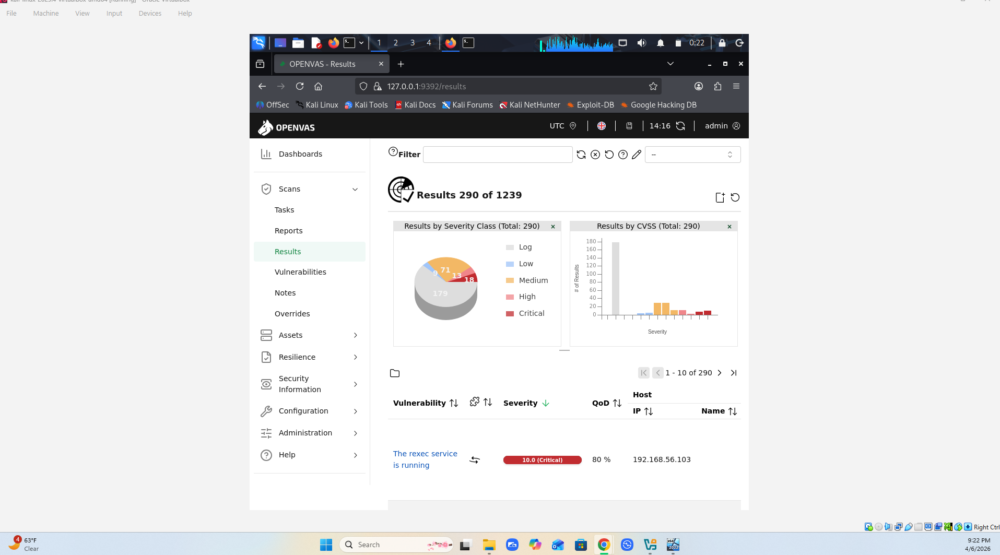
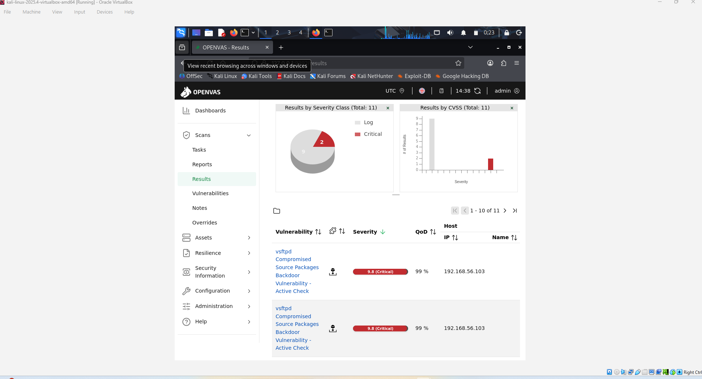
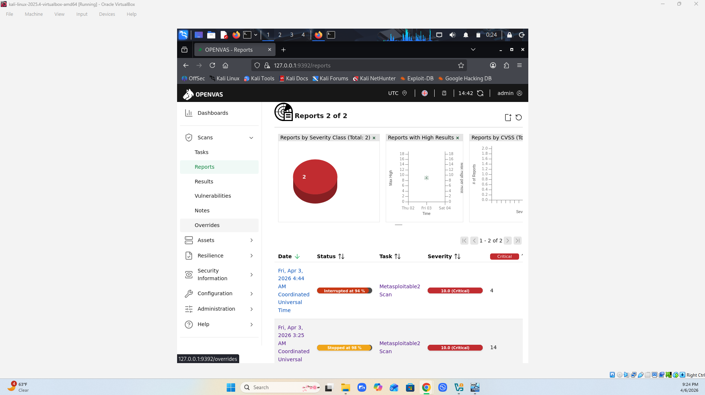

# Vulnerability Scanning Lab (OpenVAS/Greenbone)

**Tools:** Greenbone Vulnerability Manager (GVM/OpenVAS), Kali Linux, Metasploitable 2, VirtualBox  
**Year:** 2026

## What I Built
Deployed Greenbone Vulnerability Manager on Kali Linux and ran a Full and Fast scan against Metasploitable 2 in an isolated virtual network. Then validated the scanner findings by actually exploiting the critical CVEs with Metasploit.

## What I Did
Analyzed 62 total findings broken down by CVSS severity — 14 Critical, 9 High, 39 Medium, 4 Low. Triaged by score and cross-referenced the top findings with Metasploit modules. Successfully exploited all four critical CVEs: vsftpd 2.3.4, Samba usermap_script, distcc daemon, and UnrealIRCd backdoor — confirming the scanner results were accurate.

## What I Learned
Manually validating scanner output changes how you read CVE reports. A CVSS 10.0 means something different when you've actually used it to get a root shell. This lab also showed me why vulnerability management isn't just running a scan — it's understanding what the findings actually mean.

## Screenshots

*290 total findings across all severity levels against Metasploitable 2*

*vsftpd 2.3.4 backdoor identified at 9.8 Critical — later exploited via Metasploit for root shell*

*Scan report showing Metasploitable 2 scan with 10.0 Critical severity*
