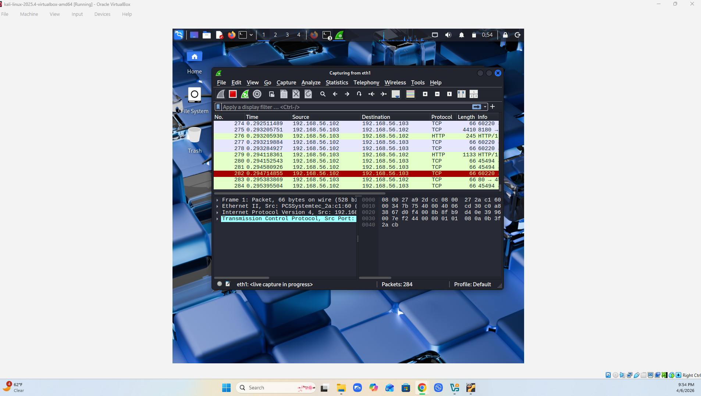
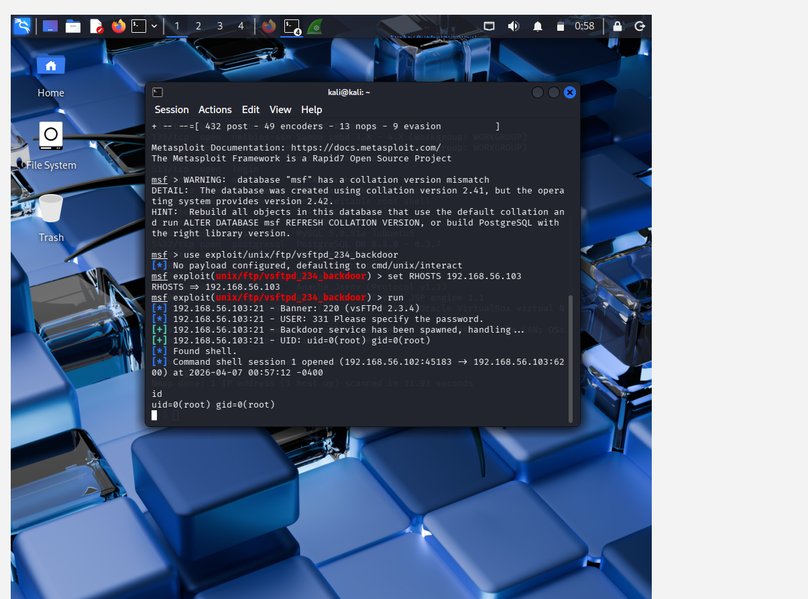

# End-to-End Attack & Detection Lab (Capstone)

**Tools:** Kali Linux, Metasploit, OpenVAS, Splunk Enterprise, Wireshark, Windows Server 2022, VirtualBox  
**Year:** 2026

## What I Built
Three-VM isolated network simulating a real attack and detection scenario. Kali as the attacker (192.168.56.105), Metasploitable 2 as the victim (192.168.56.103), and Windows Server 2022 running Splunk as the SOC defender (192.168.56.104).

## What I Did
Started with an OpenVAS vulnerability scan to identify targets, then exploited four critical CVEs using Metasploit — vsftpd 2.3.4, Samba usermap_script, distcc daemon, and UnrealIRCd — gaining root shell access via multiple vectors. Configured syslog forwarding from the compromised host to Splunk, deployed Apache and forwarded web access logs to the SIEM, and wrote SPL detection rules for web enumeration. Analyzed all attack traffic in Wireshark including SYN scans, TCP flags, and the vsftpd backdoor connection on port 6200.

## What I Learned
Seeing the attack from both sides changed how I think about detection. Knowing exactly what the exploit traffic looks like made writing the Splunk alert way more intuitive.

*Live packet capture showing TCP and HTTP traffic between attacker (192.168.56.102) and victim (192.168.56.103)*

*vsftpd 2.3.4 backdoor exploited via Metasploit — root shell obtained (uid=0)*
