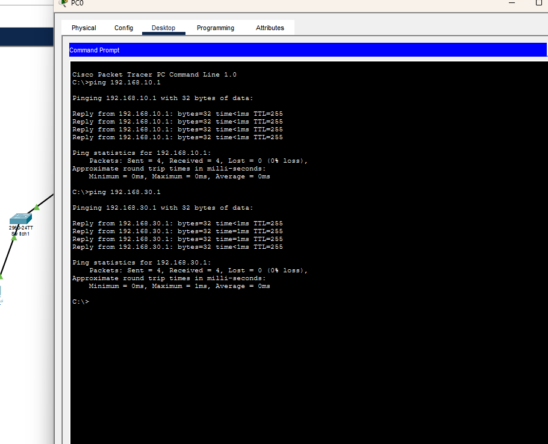
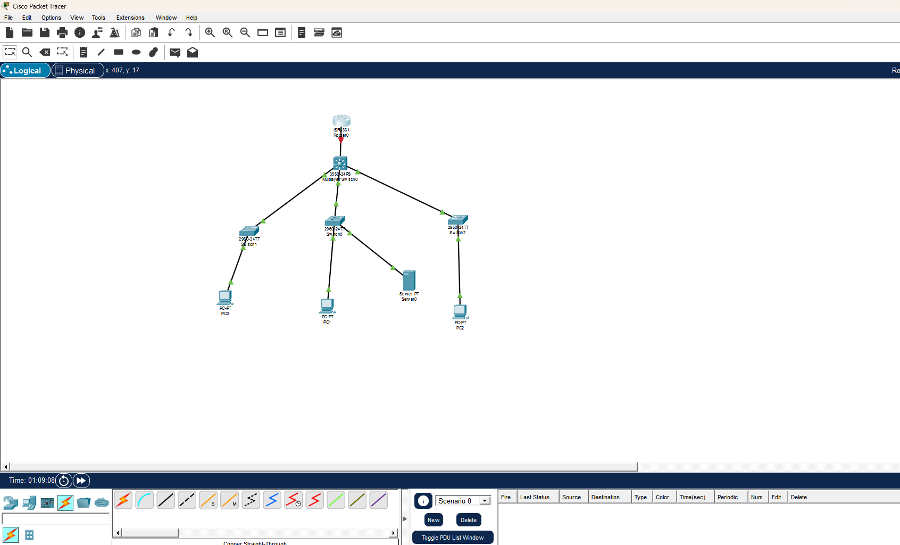
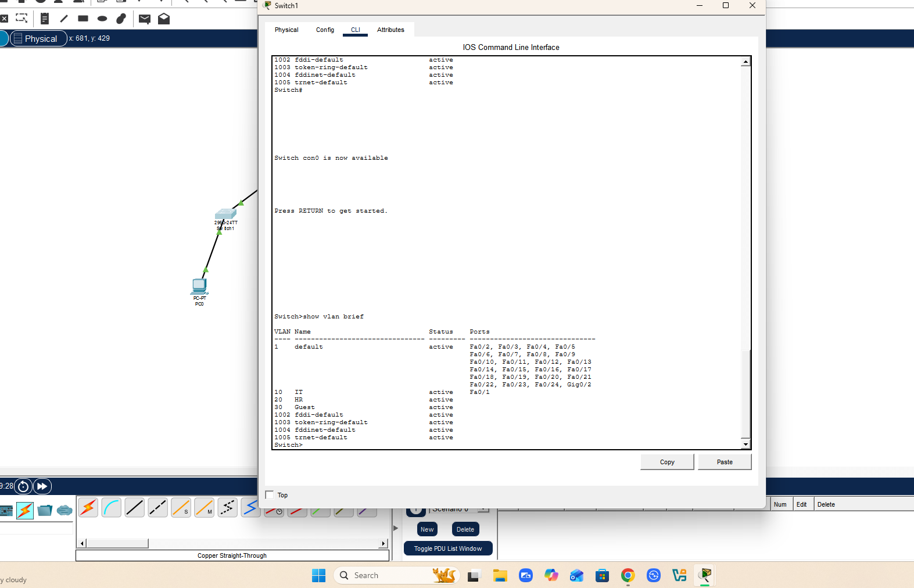
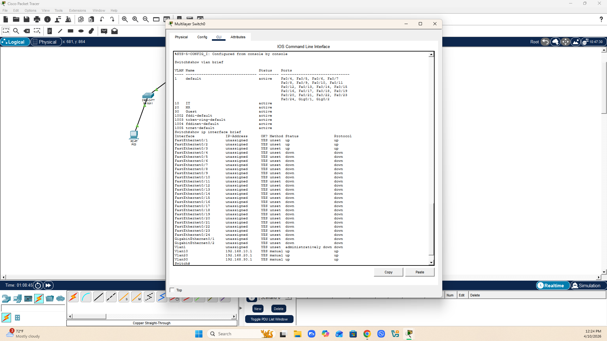
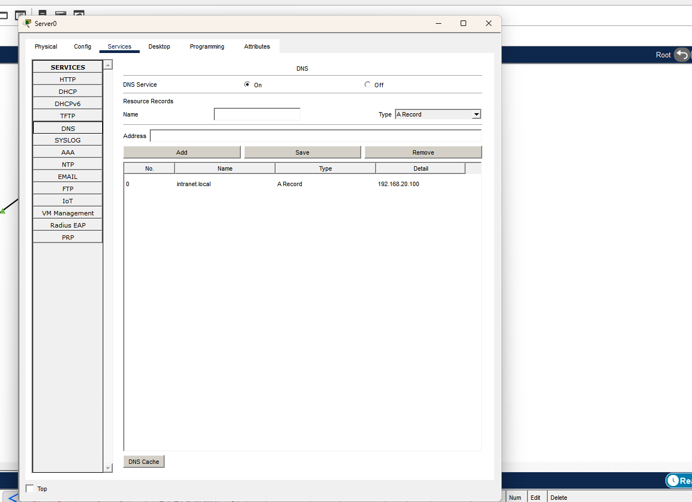
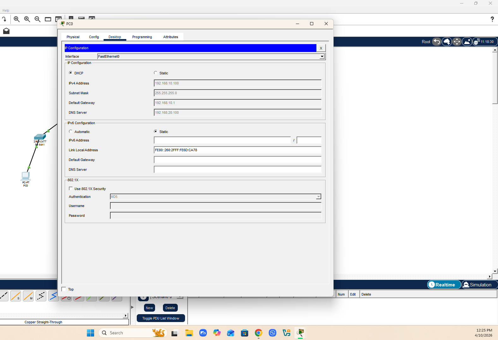
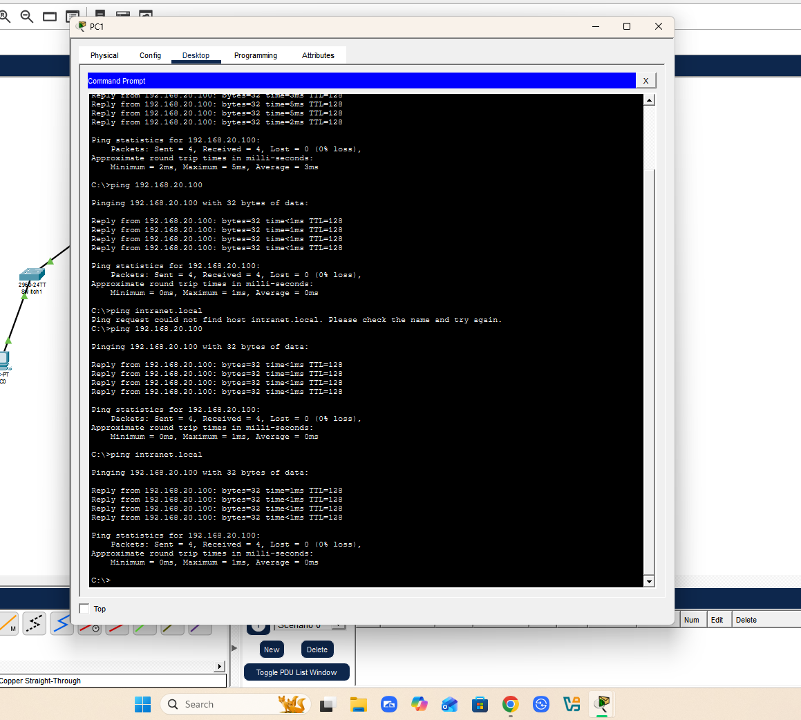
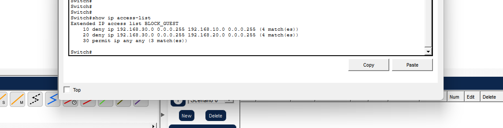
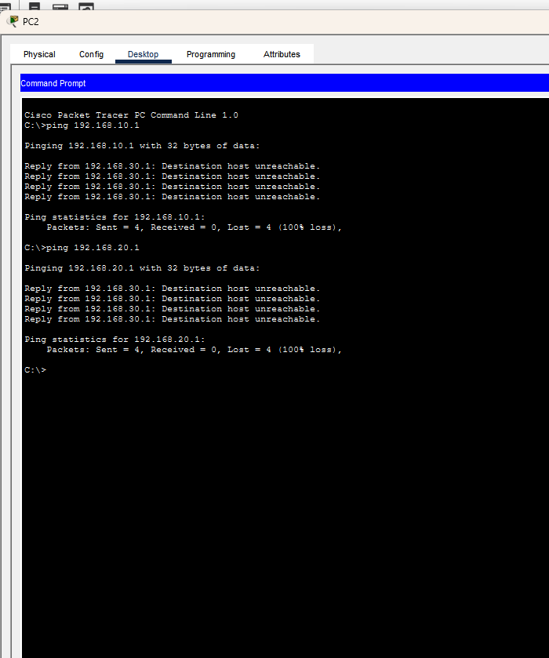

# VLAN Segmentation & ACL Lab

**Tools:** Cisco Packet Tracer, Cisco IOS CLI, Multilayer Switch (3560-24PS), 2960 Access Switches  
**Date:** April 2026  
**File:** VLAN_Segmentation_ACL_Lab.pkt

---

## Objective

Design and implement a segmented office network that enforces least privilege access control between departments using VLANs, inter-VLAN routing, DHCP, DNS, and extended ACLs. This lab simulates how enterprise networks isolate departments to reduce lateral movement risk — a core concept in network security and SOC operations.

---

## Topology

| Device | Role | VLAN |
|--------|------|------|
| Multilayer Switch0 | Core L3 Switch / DHCP Server | All |
| Switch1 | IT Access Switch | VLAN 10 |
| Switch0 | HR Access Switch | VLAN 20 |
| Switch2 | Guest Access Switch | VLAN 30 |
| PC0 | IT Workstation | VLAN 10 |
| PC1 | HR Workstation | VLAN 20 |
| PC2 | Guest Device | VLAN 30 |
| Server0 | Internal DNS/DHCP Server | VLAN 20 |

---

## IP Plan

| Segment | VLAN | Network | Gateway | DHCP Range |
|---------|------|---------|---------|------------|
| IT | 10 | 192.168.10.0/24 | 192.168.10.1 | .100–.150 |
| HR | 20 | 192.168.20.0/24 | 192.168.20.1 | .100–.150 |
| Guest | 30 | 192.168.30.0/24 | 192.168.30.1 | .100–.150 |

---

## What I Configured

**VLANs & Trunking**
- Created VLANs 10 (IT), 20 (HR), and 30 (Guest) on all switches
- Configured trunk links between Multilayer Switch0 and all three access switches using 802.1Q encapsulation
- Assigned access ports on each switch to the correct VLAN

**Inter-VLAN Routing**
- Enabled `ip routing` on Multilayer Switch0
- Created Switched Virtual Interfaces (SVIs) for each VLAN as default gateways

**DHCP**
- Configured three DHCP pools on Multilayer Switch0, one per VLAN
- Excluded .1–.99 from each pool to reserve addresses for infrastructure
- Verified automatic IP assignment on all three PCs

**DNS**
- Configured Server0 with static IP 192.168.20.100
- Enabled DNS service and created A record: `intranet.local → 192.168.20.100`
- Verified hostname resolution from PC1

**ACL — Guest Isolation**
- Created extended ACL `BLOCK_GUEST` denying Guest subnet access to IT and HR subnets
- Applied ACL inbound on VLAN 30 SVI
- Permitted all other traffic with implicit `permit ip any any`

---

## Screenshots

### Full Topology

### VLAN Configuration — Multilayer Switch0

### VLAN Configuration — Switch1 (IT)

### DHCP — PC0 Auto-Assigned IP in VLAN 10

### ACL — BLOCK_GUEST with Match Counts

### Test — PC0 (IT) Pinging Across VLANs (Success)

### Test — PC2 (Guest) Blocked by ACL

### Server0 DNS — Service On with A Record

### Test — PC1 Resolving intranet.local via DNS

---

## Test Results

| Test | Result |
|------|--------|
| PC0 (IT) → ping 192.168.20.1 (HR gateway) | ✅ Success |
| PC0 (IT) → ping 192.168.30.1 (Guest gateway) | ✅ Success |
| PC2 (Guest) → ping 192.168.10.1 (IT gateway) | ❌ Blocked by ACL |
| PC2 (Guest) → ping 192.168.20.1 (HR gateway) | ❌ Blocked by ACL |
| PC1 (HR) → ping intranet.local | ✅ Resolved to 192.168.20.100 |
| All PCs → DHCP address assignment | ✅ Correct subnet per VLAN |

---

## Security Concepts Demonstrated

- **Network segmentation** — VLANs enforce logical separation between departments
- **Least privilege** — Guest users blocked from accessing IT and HR resources
- **Defense in depth** — ACLs applied at the Layer 3 boundary, not just the edge
- **DNS infrastructure** — Internal hostname resolution simulating enterprise DNS
- **DHCP scoping** — Automatic address assignment scoped per security zone

---

## Key Commands Used
